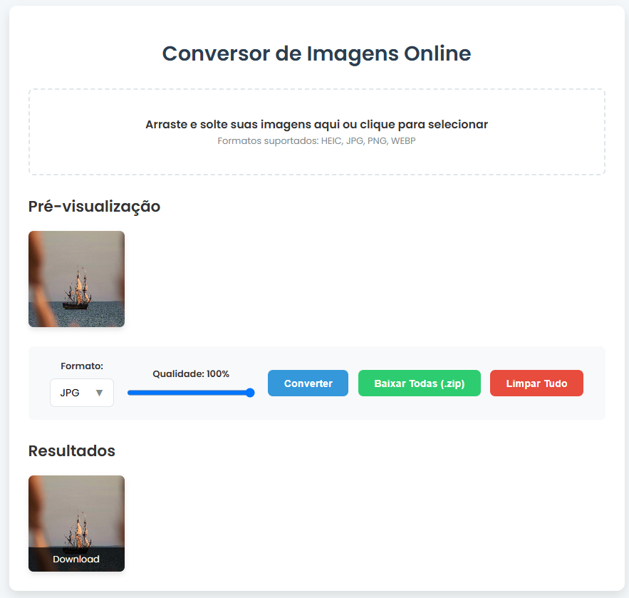

# ConverterIMG 🖼️

**ConverterIMG** é um conversor de imagens online, desenvolvido em HTML, CSS e JavaScript, que permite aos usuários transformar arquivos como HEIC, JPG e PNG para outros formatos diretamente no navegador. Com uma interface intuitiva de "arrastar e soltar", a ferramenta realiza todas as conversões no lado do cliente, garantindo privacidade e velocidade, sem a necessidade de enviar os arquivos para um servidor. Após a conversão, o usuário pode visualizar as novas imagens e baixá-las individualmente, tudo em uma única página web..

## 📸 Print da Página

## 🛠️ Tecnologias Utilizadas

  

## Desenvolvedor

| [ Demetrius Vignati](https://github.com/demetriusvas) |
| :---: |
